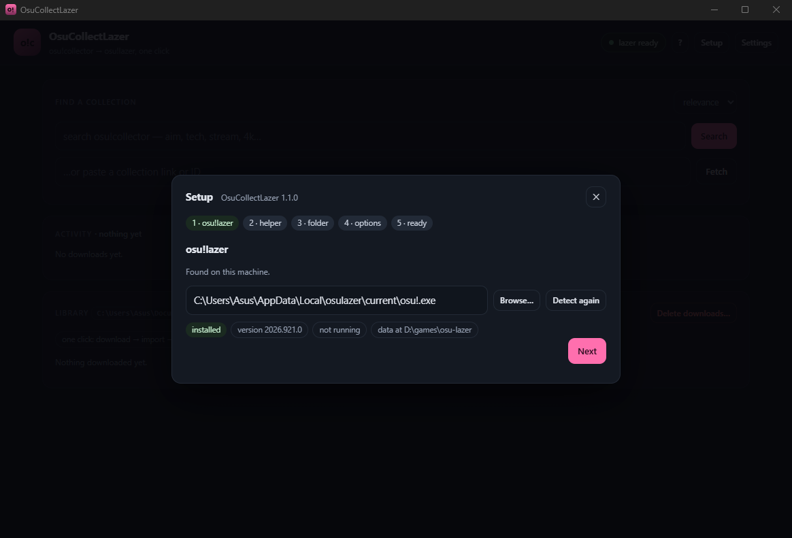

# OsuCollectLazer

Browse **osu!collector.com** collections and get them into **osu!lazer** with one click:
the app downloads a collection from public beatmap mirrors, imports every beatmapset with
lazer's own importer — in parallel, with the game closed, no import screen and no in-game
steps — deletes each archive the moment lazer has taken it, and writes the collection entry,
so the collection shows up under Collections on its own.



## Install (Windows)

Three downloads on the [latest release](https://github.com/DraccUwU/OsuCollectLazer/releases),
none of them needing Python or .NET:

| Download | What it is |
|---|---|
| `OsuCollectLazer-Setup.exe` | **recommended** — installs in one go (no admin prompt), adds Start-menu and desktop shortcuts, uninstalls from *Apps & features* |
| `OsuCollectLazer-win-x64.zip` | portable — unzip anywhere and run the exe. Starts instantly; fine on a USB stick |
| `OsuCollectLazer.exe` | a single file, nothing to unzip. It unpacks itself into `%TEMP%` on *every* launch, so with real-time antivirus the first window can take a minute or more |

First run opens a **setup wizard**: it finds osu!lazer, downloads the import helper
(~70 MB, one time) and asks where downloads should go. The app runs in its own Edge WebView2
window rather than a browser tab; the last wizard step and *Settings → App* add the
desktop/Start-menu shortcuts, and `--browser` opens a browser tab instead (which also
happens by itself if WebView2 isn't installed).

Windows may show "Windows protected your PC" once, because the exe isn't code-signed:
*More info → Run anyway*.

## Run from source

```bash
git clone https://github.com/DraccUwU/OsuCollectLazer.git
cd OsuCollectLazer
dotnet build -c Release tools/LazerDb   # the helper; needs the .NET 10 SDK
start.bat                               # or: python -m app.server
```

The app itself is plain Python standard library — no pip install, no build step. From source
the UI opens in a browser tab (the native window needs pywebview, which only the release
bundles). The helper is required for importing; without it the Library says so, and the
wizard can download or build it.

## What it does

1. **Find** — search osu!collector in the app, or paste a collection URL/ID.
2. **Download** — every beatmapset in the collection, in parallel, from a pool of public
   mirrors (nerinyan, beatconnect, catboy.best, osu.direct, sayobot, nekoha, osudl,
   hinamizawa). Archives are verified, interrupted runs resume, files already on disk are
   skipped.
3. **Import the maps** — the helper runs lazer's own `BeatmapImporter` over each batch,
   writing straight into lazer's file store and realm: ~5–6 maps/s, scaling with cores.
4. **Delete them again** — lazer's importer deletes each archive it takes, so a collection
   never has to fit on disk twice. An archive whose import *failed* is never deleted: it
   stays for a retry and is named in the job log.
5. **Add the collection** — written into lazer's realm through lazer's own
   `LegacyCollectionImporter` (a timestamped `client.realm` backup is taken first, and the
   write is skipped entirely if the installed lazer's schema version doesn't match).

One click — **Download** in the search results or on a collection page — does 2→5. Two
settings change the shape of it:

| setting | default | what it does |
|---|---|---|
| *after a download finishes* | `auto` | import → delete → write the collection. `manual` = download only, then **import now** in the Library |
| *import each wave while the download is still running* | on | the first waves are imported *during* the transfer, hiding the import inside the download |

## Speed

From the app's own job log, measured on one machine:

| path | rate |
|---|---|
| **direct import** (helper + `Parallel.ForEachAsync`) | **~5–6 maps/s**, scales with cores |
| through the running game (one path per IPC message) | ~1–2 maps/s |
| handing paths to the game's IPC pipe | 600–680 paths/s — never the bottleneck |

A 51-map collection end to end: download 27 s, maps imported in waves from second 8,
everything imported, deleted and the collection written 34 s after the click. Downloads run
10-wide (peak 18.6 MB/s, median 6.9 MB/s observed): the pool probes every mirror at the start
of a run, favours the fastest and demotes the ones that error.

## Closing the game

Two writers on one realm is a corrupt realm, so imports need lazer **closed**. The app closes
it for you (*close osu!lazer automatically*, on by default): a graceful close first, and —
because a busy game can ignore that for minutes — termination after ~12 s, with the job log
saying which of the two happened. With the setting off, imports refuse to start while the
game runs and the archives stay on disk. **Write collection** follows the same rule (the game
is re-checked immediately before the write) and answers 409 rather than writing blind.

`LazerDb --check-archive <file.osz>` explains why a particular archive won't import — useful
when a mirror serves something 7-zip opens but lazer does not.

## Where downloads go

`Documents\OsuCollectLazer\collections\<name>-<id>\`:

| file | purpose |
|---|---|
| `*.osz` | the beatmapsets — **deleted again** as the importer takes them |
| `collection.db` | the collection entry (kept — a few KB, documents what the folder was) |
| `osu!.name.cfg` | empty marker that makes lazer accept the folder as a "previous osu! install" |
| `meta.json`, `download-state.json`, `import-state.json` | resume bookkeeping, plus what the last import did |

**Library → Delete all downloads** shows a summary first (collections, total on disk) and then
deletes every collection folder — beatmaps already in lazer stay, settings are never touched.
It refuses to run while a job is going (409), can be limited to a single collection folder
inside the download root (the root itself is refused), and has a dry-run mode:

```bash
curl -X POST localhost:8765/api/library/delete -H 'Content-Type: application/json' \
     -d '{"scope":"all","dry_run":true}'
```

The API takes JSON only, refuses cross-origin callers, and requires `scope` to be stated
explicitly — a request that forgets it gets 400 instead of quietly clearing the library.

## Tests

```bash
python tests/test_collectiondb.py    # 14 checks, incl. byte-identity with ppy/osu's fixture
python tests/test_lazerdb.py         # 13 checks for the import plumbing
python tests/test_server_safety.py   # 31 checks: request validation, delete and write guards
python tests/test_setup.py           # 37 checks: wizard, migration, helper install, shortcuts
```

All four run in CI on every push; tagging `v*` builds and publishes the release.

## Requirements

**From a release:** Windows and osu!lazer — the wizard fetches the helper itself.
**From source:** also Python 3.10+ (standard library only) and the .NET 10 SDK to build
`tools/LazerDb`. The app closes osu!lazer when it imports, and never starts it.

## Layout

```
app/
  server.py        local HTTP server + JSON API (127.0.0.1:8765, single instance)
  collector.py     osu!collector client: collection fetch + search
  mirrors.py       mirror URL templates, rotation, per-mirror cooldowns
  downloader.py    parallel downloader: integrity checks, resume, stall guards
  collectiondb.py  legacy collection.db writer/reader (byte-exact, see tests)
  lazer.py         lazer detection, data directory, closing the game for imports
  lazerdb.py       drives tools/LazerDb: parallel map import + realm collection write
  library.py       download folder scanning / import state
  setup.py         wizard backend: detection, native pickers, helper install
  shortcuts.py     desktop / Start-menu shortcuts
  version.py       version + the asset names CI publishes
  launcher.py      entry point of the packaged exe (window, logging, single instance)
  web/             the UI (vanilla HTML/CSS/JS) + the setup wizard
tools/LazerDb/     .NET console app: parallel BeatmapImporter + LegacyCollectionImporter
packaging/         PyInstaller specs (folder + single file), Inno Setup script, icon, versions
tests/             14 + 13 + 31 + 37 checks, all run in CI
```

## Releasing

The version lives in `app/version.py` and `packaging/version_info.txt`. Bump both, then:

```bash
git tag v1.1.0 && git push origin v1.1.0
```

CI builds and attaches four downloads: the installer (compiled with Inno Setup, version
passed in from `app/version.py`), the single-file build, the portable zip, and the
self-contained helper. Before zipping it drops `osu.Game.Resources.dll` — 128 MB of fonts and
textures for lazer's own UI, which the headless import never loads. The wizard looks for
`LazerDb-win-x64.zip` by name, and `tests/test_setup.py` fails if the workflow and
`app/version.py` ever disagree.

The helper is pinned to a `ppy.osu.Game` version, and lazer's realm schema moves with it: when
a lazer update moves the schema, bump `tools/LazerDb/LazerDb.csproj`, tag a release, and
installs pick the new helper up through **Setup** in the header — the app refuses to write
into a database it does not match.

## Notes

* Importing outside the game needs the ruleset assemblies: without them the `.osu` decoder
  cannot instantiate a game mode and every map fails with `No valid beatmap files found in
  the beatmap archive` — a message about the archive that is really about missing rulesets.
* Lazer's IPC import carries one path per message, so going *through* the running game is
  always one map at a time. That is the reason the helper exists.
* An archive already in lazer counts as imported and is still deleted, which makes a re-run
  over the same folder idempotent.
* Deletion is gated per file on the helper's report: anything in `failed_files` stays on disk,
  and a job that fails before importing deletes nothing at all.
* A busy osu!lazer ignores a graceful close — `taskkill` without `/F` reports success while
  the game keeps scanning — hence the escalation, and the log line that tells you.
* Mirror quirks are handled automatically: redirects between mirrors, rate limits with
  cooldowns, and a slow mirror dropped after 30 s below 25 KB/s. `nzbasic` ships disabled
  because it answered with non-archives when probed.

## Alternatives

[osu-collect](https://github.com/uwuclxdy/osu-collect) (TUI) downloads a collection to a
folder and lazer's import screen takes it from there — the same route this app automates. The
official osu!Collector desktop app (paid) does not support lazer collections at all.

## Credits

Built against [ppy/osu](https://github.com/ppy/osu) — the helper drives its real import code
paths (`BeatmapImporter`, `LegacyCollectionImporter`, `ShouldDeleteArchive`) — and using mirror
URL templates established by [osu-collect](https://github.com/uwuclxdy/osu-collect). Beatmap
data comes from [osu!collector](https://osucollector.com/) and the public mirrors, not from
this project.

Unofficial: not affiliated with osu!, ppy Pty Ltd, or osu!collector.

## License

[MIT](LICENSE).
